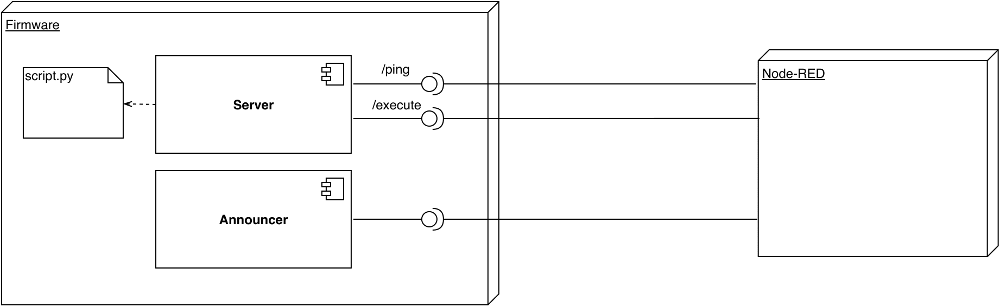

# ESP-FIRMWARE

This repository contains the firmware developed for the work made in this [Node-RED repository](https://github.com/BeeMargarida/node-red). Related to my [dissertation](https://repositorio-aberto.up.pt/handle/10216/128520).
.
The first challenge was to find a way to take advantage of the constrained devices by making them run arbitrary scripts of code and communicate with other devices. Since both selected devices can run MicroPython firmware, Python was the selected programming language. Further, MicroPython already packs a small-footprint HTTP server and packages are available to implement asynchronous operations --- *i.e.* `uasyncio` --- and MQTT publisher-subscriber (*viz*  pub-sub) communication --- *i.e.* `MicroPython-mqtt`.

As the devices must be able to receive arbitrary Python scripts (sent by Node-RED) and run them, the HTTP server was used to receive the Python payloads, which are then saved in the device SPI Flash and can be later executed (loaded to the SRAM). Further, the same HTTP server was used to implement an endpoint that returns the state of the device, as well as an announcing mechanism. These features built as an integral part of the firmware that runs on the devices. An overview of the components of the firmware can be seen in the figure below.

The firmware also includes a `fail-safe` mechanism, safeguarding against `Out-of-Memory` errors that may happen during the lifespan of the device (SRAM usage). This mechanism resets all running tasks and recovers the HTTP server and communication channels. This is an important feature due to the high probability of these error's occurrence since the devices have limited memory. 

## Docker MicroPython

Docker image that setups a micropython container that executes a boot script at startup.

### Setup

Download this folder or repo and in this directory run:

* `docker-compose build`
* `docker-compose up` (with `-d` if you want to run in detached mode)

These commands will run the wanted instances of microptyhon containers as well as a mosquitto broker.

The micropython container contains the needed scripts for the wanted functionalities and it starts the server automatically. If you want access to the IPs, run: 

`docker ps -q | xargs -n 1 docker inspect --format '{{ .Name }} {{range .NetworkSettings.Networks}} {{.IPAddress}}{{end}}' | sed 's#^/##';`

### Setup with Node-RED

After completing the instructions above, you may want to setup the containers with node-red. First, clone this [repo](https://github.com/S-R-MSc/margaridasilva-nodered). After the usual `npm install` you need to make a specific setup. 

Inside there you need to setup 2 things:
* Change the **devices URLs** in *packages/node_modules/@node-red/runtime/lib/nodes/config/devices.js* with the IPs from the docker containers
* Change the **MQTT Broker URL and PORT** in *packages/node_modules/@node-red/runtime/lib/nodes/config/config.js* with the IP from the docker container running the Mosquitto broker.

With all that set up, we can start Node-RED and make a flow.

#### Commands 

To stop a running container: 

`docker stop testing_micropython_1_1`

To start a running container: 

`docker start testing_micropython_1_1`

**Aux commands**

To access a container's logs:

`docker logs -t -f testing_micropython_1_1`

List all docker container names and IPs:

`docker ps -q | xargs -n 1 docker inspect --format '{{ .Name }} {{range .NetworkSettings.Networks}} {{.IPAddress}}{{end}}' | sed 's#^/##';`

Get ip addresses of container:

`docker inspect -f '{{range .NetworkSettings.Networks}}{{.IPAddress}}{{end}}' docker-micropython_micropython_1`

Remove all images:

`docker rmi $(docker images -a -q)`

Stop and remove all containers:

`docker stop $(docker ps -a -q)`

`docker rm $(docker ps -a -q)`

Prune: 

`docker system prune`

Enter container bash:

`docker exec -it docker-micropython_micropython_1 bash`

Misc:
`mosquitto_pub -h - -p 1883 -t 't1' -m $(date +%s%3N)`

`mosquitto_sub -h - -p 1883 -t 't1' -v -F "%t %p %U"`

`mosquitto_sub -h - -p 1883 -t "#" -v -F "%t %p %U" >> subs.txt`

`docker-compose up --scale micropython=10`
